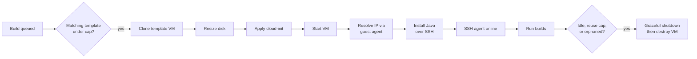

# Proxmox Cloud Plugin

[](https://ci.jenkins.io/job/Plugins/job/proxmox-cloud-plugin/job/main/)
[](https://plugins.jenkins.io/proxmox-cloud)
[](https://plugins.jenkins.io/proxmox-cloud)
[](https://github.com/jenkinsci/proxmox-cloud-plugin/releases/latest)

A Jenkins cloud provider that runs your build agents as ephemeral QEMU virtual machines on
[Proxmox VE](https://www.proxmox.com/). When the build queue needs capacity, the plugin clones a VM
template (Linux clones are configured through cloud-init; Windows clones boot preconfigured from a
sysprep-generalised image), connects over SSH, and tears the VM down once it goes idle, leaving
nothing running between builds.

It is built for on-prem and homelab CI: the elastic agent pool is your own Proxmox hardware, so
there is no cloud bill and build data stays on your network. The design follows the Jenkins
[EC2 plugin](https://plugins.jenkins.io/ec2/) closely (see
[Comparison with the EC2 plugin](#comparison-with-the-ec2-plugin)), and the two run well side by
side for a hybrid on-prem/cloud fleet.

Requires Jenkins 2.528 or newer and Proxmox VE 8.x or 9.x. Agents connect over SSH, so provisioned
VMs must be reachable from the controller.

## Table of contents

- [Features](#features)
- [How it works](#how-it-works)
- [Setup](#setup)
- [Windows agents](#windows-agents)
- [Agent lifecycle and scaling](#agent-lifecycle-and-scaling)
- [Java auto-installation](#java-auto-installation)
- [Configuration as Code](#configuration-as-code)
- [Comparison with the EC2 plugin](#comparison-with-the-ec2-plugin)
- [Known limitations](#known-limitations)
- [Building from source](#building-from-source)
- [Contributing](#contributing)
- [License](#license)

## Features

- **On-demand agents** cloned from a VM template, scaled to the build queue and destroyed when idle.
- **Linux and Windows agents**: Linux clones are configured through cloud-init at boot; Windows
  agents run from a sysprep-generalised template.
- **Concurrent provisioning** up to the configured cap, so a cloud fills in roughly one clone time
  rather than serially.
- **Per-template and per-cloud instance caps** to bound how many VMs run at once.
- **Warm pool** (per-template minimum instances) that keeps a baseline of agents ready and is never
  idle-reaped below the minimum.
- **Reuse limit** (max total uses) that recycles an agent after a set number of builds.
- **Java auto-install** over SSH (OpenJDK or Amazon Corretto), so Linux templates do not need Java
  preinstalled.
- **Disk resize at clone time**, so a thin template image can grow to the agent size on provision.
- **CPU / memory / storage / pool / network bridge / cloud-init overrides** applied per template.
- **Orphan and dead-node reconciliation** that destroys leaked VMs and removes stale nodes after a
  configurable, per-cloud period.
- **VM-ID-reuse-safe teardown**: every destroy is ownership-verified and idempotent.
- **Configuration as Code** from a YAML file in a git repository, with scheduled sync, drift
  detection, and read-only protection.
- **Cloud Statistics integration**: agents are reported to the [Cloud Statistics
  plugin](https://plugins.jenkins.io/cloud-stats/), so their provisioning, launch, operating, and
  completion phases (and failures) show up under Manage Jenkins -> Cloud Statistics.

## How it works



Disk resize and Java install are skipped when not configured. Windows templates skip the cloud-init
and Java install steps entirely: clones boot from a sysprep-generalised image with SSH access and
Java already in place (see [Windows agents](#windows-agents)).

## Setup

The steps below set up a Linux agent template end to end. Steps 1, 3, and 4 apply to Windows as
well; [Windows agents](#windows-agents) replaces steps 2 and 5.

### 1. Proxmox API token

Create a dedicated user, role, and API token on your Proxmox host.

Proxmox v9.x
```bash
# Create a role with minimum required privileges
pveum role add JenkinsProvisioner -privs "VM.Allocate VM.Clone VM.Audit VM.Config.Disk VM.Config.CPU VM.Config.Memory VM.Config.Network VM.Config.Options VM.Config.Cloudinit VM.PowerMgmt VM.GuestAgent.Audit Datastore.AllocateSpace Datastore.Audit SDN.Use"

# Create a user
pveum user add jenkins@pve

# Assign the role at the root path (or scope to a specific /pool/... path)
pveum aclmod / -user jenkins@pve -role JenkinsProvisioner

# Create an API token (--privsep 0 = token inherits user permissions)
pveum user token add jenkins@pve jenkins-token --privsep 0
```

Proxmox v8.x
```bash
# Create a role with minimum required privileges
pveum role add JenkinsProvisioner -privs "VM.Allocate VM.Clone VM.Audit VM.Config.Disk VM.Config.CPU VM.Config.Memory VM.Config.Network VM.Config.Options VM.Config.Cloudinit VM.PowerMgmt VM.Monitor Datastore.AllocateSpace Datastore.Audit SDN.Use"

# Create a user
pveum user add jenkins@pve

# Assign the role at the root path (or scope to a specific /pool/... path)
pveum aclmod / -user jenkins@pve -role JenkinsProvisioner

# Create an API token (--privsep 0 = token inherits user permissions)
pveum user token add jenkins@pve jenkins-token --privsep 0
```

Save the output. You will need:
- **Token ID**: `jenkins@pve!jenkins-token`
- **Token Secret**: the UUID printed by the command

#### Privilege reference

| Privilege | Purpose |
|---|---|
| `VM.Allocate` | Create and remove VMs (includes reserving VM IDs and destroying VMs) |
| `VM.Clone` | Clone templates |
| `VM.Audit` | Read VM config and status |
| `VM.Config.Disk` | Configure/resize disks on cloned VMs |
| `VM.Config.CPU` | Override CPU cores |
| `VM.Config.Memory` | Override memory |
| `VM.Config.Network` | Configure network interfaces |
| `VM.Config.Options` | Set general VM options |
| `VM.Config.Cloudinit` | Inject cloud-init parameters |
| `VM.PowerMgmt` | Start, stop, shutdown VMs |
| `VM.GuestAgent.Audit` | Query guest agent for IP address (v9.x; on v8.x use `VM.Monitor` instead) |
| `Datastore.AllocateSpace` | Allocate disk space for clones |
| `Datastore.Audit` | List available storage pools |
| `SDN.Use` | Use network bridges |

### 2. VM template with cloud-init

Create a VM template that has cloud-init and the QEMU guest agent. The example below uses Ubuntu 24.04, but any cloud-init-enabled image works.

```bash
# Download a cloud image
wget https://cloud-images.ubuntu.com/noble/current/noble-server-cloudimg-amd64.img

# Create a VM (adjust storage and bridge to match your setup)
qm create 9000 --name ubuntu-template --memory 2048 --cores 2 --net0 virtio,bridge=vmbr0

# Import the cloud image as a disk
qm importdisk 9000 noble-server-cloudimg-amd64.img local-lvm

# Attach the disk
qm set 9000 --scsihw virtio-scsi-pci --scsi0 local-lvm:vm-9000-disk-0

# Add a cloud-init drive
qm set 9000 --ide2 local-lvm:cloudinit

# Set boot order to the imported disk
qm set 9000 --boot order=scsi0

# Enable the QEMU guest agent (required for IP discovery)
qm set 9000 --agent enabled=1

# Add serial console (needed for cloud-init on some images)
qm set 9000 --serial0 socket --vga serial0

# Convert to template
qm template 9000
```

**Note:** The default cloud image disk is ~3.5GB. You do not need to resize it here; the plugin can resize the disk at clone time via the "Disk Size GB" template setting. Set it to at least 10GB if you plan to install Java automatically.

The plugin resizes `scsi0` (the disk used in the commands above). If your template's primary disk is on a different bus (`virtio0`, `sata0`), leave Disk Size GB at 0 and size the template image directly.

### 3. SSH key pair

Generate a key pair for Jenkins to connect to provisioned VMs:

```bash
ssh-keygen -t ed25519 -f ~/.ssh/jenkins-proxmox -N "" -C "jenkins-agent"
```

Add the **private key** (`~/.ssh/jenkins-proxmox`) as a Jenkins SSH credential (see step 4). The plugin automatically derives the public key from the credential and injects it into VMs via cloud-init at provision time. You do not need to configure the public key separately.

### 4. Jenkins credentials

You need two credentials in Jenkins. Add both via **Manage Jenkins → Credentials → System → Global credentials → Add Credentials**.

#### Proxmox API Token credential

| Field | Value |
|---|---|
| Kind | **Proxmox API Token** (added by this plugin) |
| Scope | Global |
| ID | e.g. `proxmox-api-token` |
| Description | e.g. `Proxmox API Token` |
| Token ID | `jenkins@pve!jenkins-token` (from step 1) |
| Token Secret | The UUID secret (from step 1) |

#### SSH credential for agent connection

| Field | Value |
|---|---|
| Kind | **SSH Username with private key** |
| Scope | Global |
| Username | `ubuntu` (the default user in Ubuntu cloud images) |
| Private Key | Enter directly → paste contents of `~/.ssh/jenkins-proxmox` (from step 3) |
| ID | e.g. `proxmox-ssh-key` |
| Description | e.g. `Proxmox Agent SSH Key` |

### 5. Jenkins cloud configuration

Go to **Manage Jenkins → Clouds → New cloud → Proxmox VE**.

#### Cloud settings

| Field | Value |
|---|---|
| Cloud Name | e.g. `proxmox` |
| API URL | `https://<proxmox-host>:8006` |
| Credentials | Select the **Proxmox API Token** credential created above |
| Ignore SSL Errors | Check if using self-signed certs (Proxmox default) |

Click **Test Connection**; it should report the Proxmox VE version.

Under cloud **Advanced** you can also set the per-cloud **Instance Cap**, **Operation Timeout**,
**Start VM ID**, and the **Cleanup Orphaned Agents** options. These are covered in
[Agent lifecycle and scaling](#agent-lifecycle-and-scaling).

#### Template settings

A cloud can hold multiple templates. **Add Template** creates a blank one; **Copy Template** (next to
it) duplicates an existing template's current on-form values into a new row, leaving the Name blank.

| Field | Value |
|---|---|
| Name | e.g. `ubuntu-agent` |
| Proxmox Node | Your node name (e.g. `pve`, `node1`) |
| Template selection | Static VM id (e.g. `9000`), or dynamic by name regex / tag (see below) |
| Labels | e.g. `linux ubuntu` |
| Number of Executors | `1` |
| Clone Strategy | Full Clone |
| OS Type | Linux. For Windows templates, see [Windows agents](#windows-agents) |
| VM Username | `ubuntu`. The user cloud-init creates on the VM; must match the SSH credential username. Blank keeps the image's default user |
| Remote FS Root | *(blank)*. Agent work directory; blank defaults to `/home/<VM Username>/agent`. Required for Windows |
| SSH Credentials | Select the **SSH Username with private key** credential |
| Usage | Only build jobs with label expressions matching this node |

##### Template selection

Three modes choose the template VM to clone:

- **Clone a specific template VM id**: the current dropdown; the id is fixed at save time.
- **Clone the newest template whose name matches a regular expression**: a
  [Java regex](https://docs.oracle.com/en/java/javase/21/docs/api/java.base/java/util/regex/Pattern.html)
  matched against the entire template name (use `.*` for partial matches).
- **Clone the newest template with a tag**: an exact Proxmox tag, compared case-insensitively.

The dynamic modes re-resolve on the configured node at every provision, so templates rebuilt on a
schedule under fresh VM ids are picked up automatically. When several templates match, the most
recently created wins (highest `ctime` from the VM config's `meta` property; templates without one
count as oldest; ties go to the highest VM id). The form shows how many templates currently match
and which one would be cloned; zero matches is allowed at save time but provisioning fails until a
template matches.

Under **Advanced → Proxmox Resources**:

| Field | Value | Description |
|---|---|---|
| Target Storage | *(blank)* | Storage pool for clone disk. Blank = same as template |
| Target Pool | *(blank)* | Proxmox resource pool to place the VM in. Blank = none |
| CPU Cores | `0` | 0 = inherit from template |
| Memory MB | `0` | 0 = inherit from template |
| Disk Size GB | `10` | Resize scsi0 after clone. 0 = keep template size |
| Network Bridge | *(blank)* | Bridge for the clone's network interface (e.g. `vmbr0`). Blank = inherit from template |

Under **Advanced → Agent Settings**:

| Field | Value | Description |
|---|---|---|
| Java Distribution | None | Auto-installs Java if not present: None, OpenJDK, or Amazon Corretto |
| Java Major Version | `21` | Major version to install (e.g. 21, 25), editable; ignored when distribution is None |
| Java Path | `java` | Path to the java binary, used only when Java Distribution is None |
| JVM Options | *(blank)* | Extra options for the agent JVM, e.g. `-Xmx512m` |
| Name Prefix | `jenkins-agent-` | Prefix for generated VM names; the VM ID is appended |

Under **Advanced → Cloud-Init**:

| Field | Value |
|---|---|
| IP Configuration | `ip=dhcp` (or `ip=10.0.0.50/24,gw=10.0.0.1` for a static address) |
| Nameserver | *(optional)* DNS server for the agent |
| Search Domain | *(optional)* DNS search domain |

The SSH public key is automatically derived from the SSH credential selected above and injected into the VM via cloud-init.

These fields, together with VM Username, map to Proxmox's built-in cloud-init parameters (`ipconfig0`, `nameserver`, `searchdomain`, `ciuser`, `sshkeys`), which the plugin sets through the API.

Under **Advanced → Lifecycle**:

| Field | Default | Description |
|---|---|---|
| Idle Termination (minutes) | 30 | Destroy the VM after this idle time. 0 = never |
| Instance Cap | 0 (unlimited) | Max concurrent VMs from this template |
| Instance Minimum | 0 (none) | Warm-pool size kept ready (must be `<= Instance Cap`) |
| Max Total Uses | 0 (unlimited) | Recycle the agent after N builds |
| Startup Wait (seconds) | 60 | Time to wait for VM boot, IP, and SSH |

### 6. Provision a test agent

The **Nodes** page (**Manage Jenkins → Nodes**) shows a "Provision via" button for each configured
template. Clicking it clones and starts a VM immediately, without waiting for demand. Alternatively,
create a freestyle job with a matching label expression:

```bash
hostname
ip addr
java -version
cat /etc/os-release
```

Run it. The plugin clones the template, resizes the disk, boots the VM, installs Java if configured,
connects over SSH, runs the build, and terminates the agent after the idle timeout.

## Windows agents

Setup steps 1, 3, and 4 apply unchanged to Windows; this section replaces step 2 (the VM template)
and step 5 (the template settings). Tested on Windows Server 2022. Other versions should work with
the same steps; the main variable is VirtIO driver availability and the exact path of the
VirtIO/QEMU Guest Agent installer.

Windows agents take a different approach from Linux: instead of configuring the clone at provision
time, everything the agent needs (the `jenkins` account, its SSH key, Java) is baked into the
template.
[Sysprep](https://learn.microsoft.com/en-us/windows-hardware/manufacture/desktop/sysprep--system-preparation--overview),
Microsoft's system preparation tool, makes that template safe to clone: run once during template
creation (step 10 below), it generalises the image by removing machine-specific state such as the
hostname and machine SID. Windows rebuilds that state on each clone's first boot, which is why a
Windows clone takes longer to accept SSH connections than a Linux one, and why a higher Startup
Wait is recommended.

When OS Type is set to **Microsoft Windows** in a template, the following fields are hidden
because they are Linux or cloud-init concepts with no effect on Windows VMs:

- VM Username
- Java Distribution
- Java Major Version
- IP Configuration
- Nameserver
- Search Domain

### Creating the Proxmox template

1. Create a new VM in Proxmox (OVMF/UEFI firmware, TPM 2.0, VirtIO SCSI controller).
2. Boot from a Windows Server ISO. Install VirtIO drivers during setup (from the VirtIO ISO,
   attached as a second CD-ROM).
3. After installation, run the VirtIO Guest Tools installer to get the QEMU Guest Agent
   component. Set the "QEMU Guest Agent" service to start automatically.
4. Enable the guest agent for the VM in Proxmox: VM settings, Options, QEMU Guest Agent.
   Or via CLI: `qm set <vmid> --agent enabled=1`. This is required for IP discovery.
5. Install OpenSSH Server: Settings, Optional Features, Add a Feature, OpenSSH Server.
   Set the `sshd` service to start automatically.
6. Create a local `jenkins` user account.
7. Place the SSH public key in `C:\Users\jenkins\.ssh\authorized_keys`.
8. In `C:\ProgramData\ssh\sshd_config`, set `AuthorizedKeysFile .ssh/authorized_keys`
   and `StrictModes no`. Restart the `sshd` service.
9. Install Java 21 or later (Eclipse Temurin or similar) and verify `java -version` works
   in a new PowerShell window (confirming it is on the system PATH for SSH sessions).
10. Run sysprep to generalise the image: open `C:\Windows\System32\Sysprep\sysprep.exe`,
    select "Enter System Out-of-Box Experience (OOBE)", check "Generalize", set shutdown
    option to Shutdown. This resets the hostname and SID on each clone.
11. Once the VM has shut down, convert it to a Proxmox template (right-click, Convert to
    Template).

**Profile path note.** On first boot of a clone, Windows registers the `jenkins` user
profile at `C:\Users\jenkins.<ORIGINAL-HOSTNAME>`, where `<ORIGINAL-HOSTNAME>` is the
hostname the template VM had before sysprep. This path is stable across clones because
Windows maps SIDs to profile paths and sysprep preserves the SID assignment. Use this path
as the base for Remote FS Root in the Jenkins template config.

### Configuring the Jenkins template

| Field | Value |
|---|---|
| OS Type | Microsoft Windows |
| Template VM ID | ID of your Windows template VM |
| SSH Credentials | Username `jenkins`, private key matching `authorized_keys` |
| Remote FS Root | Required. Full path to the agent work directory, e.g. `C:\Users\jenkins.<ORIGINAL-HOSTNAME>\agent` |
| Java Path | `java` if on the system PATH, or the full path to `java.exe` |
| Startup Wait (seconds) | 300 is recommended. Windows sysprep finalization takes longer than a Linux cloud-init boot. |

Java auto-install is Linux-only (it uses apt over SSH), so the template must have Java
preinstalled (step 9 above); the hidden Java Distribution field is fixed at None for Windows
templates.

### Startup behaviour

Windows OpenSSH accepts TCP connections a few seconds before its auth subsystem is ready
during first-boot sysprep finalization. The plugin handles this with an authentication retry
loop after the port-open check; no configuration is needed, but keep Startup Wait high enough
to cover the full boot time.

For YAML-managed Windows templates, see the notes in
[Configuration as Code](#configuration-as-code).

## Agent lifecycle and scaling

The retention behaviour is intentionally close to the EC2 plugin's. Idle timeout and reuse cap are
seeded from the template at provision time but **owned by each agent**, so you can override them on a
specific agent's config page (for example, to keep one VM alive for diagnostics) without touching the
template.

### Instance caps

Caps apply at two levels. Each **template** has its own `Instance Cap`, and the **cloud** has an
overall `Instance Cap` across all of its templates. Provisioning fills concurrently up to whichever
limit binds first. Dead nodes (a channel offline beyond the grace period, or a node whose VM is
gone) are excluded from cap accounting, so they cannot hold a cap slot and block a healthy
replacement.

### Idle termination

An idle agent is destroyed once it has been idle longer than `Idle Termination (minutes)`. Set it to
0 to disable idle reaping (useful for static, always-on agents, or when a warm pool manages the
count). Agents held by a warm-pool minimum are exempt.

### Reuse limit (max total uses)

`Max Total Uses` caps how many builds an agent runs before it is recycled. The cap is enforced at
dispatch time (so a capped agent stops accepting work immediately) and the agent is destroyed the
moment its last build finishes, rather than waiting for the next periodic check. Use counts are
tracked per task, so they are correct for both freestyle builds and Pipeline `node {}` blocks.

### Warm pool (minimum instances)

Set a template's `Instance Minimum` to keep that many agents provisioned and ready ahead of demand.
The pool is topped up on config save, at startup, on each cleanup tick, and immediately after a
max-uses recycle. The retention strategy will not idle-reap an agent if doing so would drop the
template below its minimum. The minimum must not exceed the instance cap; this is enforced on save.

The warm pool only ever scales **up**. Lowering a minimum drains the surplus through normal idle
termination, so warm agents are only removed when `Idle Termination` is greater than 0. Because
lifecycle settings are baked in per agent at provision time, set the template's idle timeout before
provisioning the pool.

### Orphan and dead-node cleanup

Enable **Cleanup Orphaned Agents** on the cloud to run a background reconciler. Each pass:

- destroys VMs tagged `jenkins-managed` for this cloud that have no corresponding Jenkins node
  (leaked, for example, by a controller crash mid-provision), and
- removes Jenkins nodes whose backing VM is gone or stopped, or whose agent channel has been offline
  past the grace period while the VM still runs.

The **Orphan Cleanup Period** (default 600s, minimum 30s) controls how often a cloud is reconciled
and is editable live in the UI. A freshly cloned or briefly disconnected agent is protected by the
**Orphan Cleanup Grace Period** (default 300s) so it is never reaped mid-launch. Every destroy first
re-confirms the VM still carries this cloud's ownership marker, so a reused VM ID is never destroyed
by mistake.

> Lowering a cloud's period *below* the cadence the reconciler is already scheduled at requires a
> Jenkins restart to take effect faster; an administrative monitor surfaces this when it happens.
> The `jenkins.proxmox.orphanCleanupPeriodMs` system property overrides both the cadence and the
> per-cloud period for every cloud.

### Start VM ID

`Start VM ID` (cloud Advanced) sets the floor for cloned VM IDs. Set it above every existing VM and
container ID on the node so provisioning never collides with manually managed guests. The plugin
reserves the lowest free ID at or above this floor for each clone.

## Java auto-installation

The plugin can install a JRE on provisioned Linux agents at launch, so the template image does not
need Java preinstalled. This applies to Linux agents only; Windows templates must have Java
preinstalled (see [Windows agents](#windows-agents)). Pick a **Java Distribution** and a
**Java Major Version**:

| Distribution | Package installed |
|---|---|
| OpenJDK | `openjdk-<version>-jre-headless` |
| Amazon Corretto | `java-<version>-amazon-corretto-jdk` |

The major version is an editable combobox: the dropdown suggests common versions (21, 25), but you can type any version. 21 or newer is recommended; older versions are allowed but flagged with a warning. The package name is built from the distribution and version, so new releases work without a plugin update, as long as the package exists in the agent image's apt repositories. OpenJDK is installed from the distro's own repositories; Corretto from Amazon's apt repository. A version that is not available there fails the install with an apt error in the agent launch log.

The install process:
1. Waits for cloud-init to finish (avoids apt lock conflicts)
2. Cleans apt cache to free disk space
3. Installs the selected JRE (adding the Corretto apt repository first, for Corretto)
4. Removes unneeded packages and cleans up

Requirements: an apt-based image and passwordless `sudo` for the SSH user (both default for Ubuntu
cloud images).

When Java Distribution is **None**, no install runs and the agent uses the `Java Path` you configure (or
auto-detects `java` on the PATH if left at the default).

## Configuration as Code

Cloud and template configuration can live in a YAML file in a git repository and be synced into
Jenkins on a schedule or on demand. This keeps your agent fleet in source control: review changes via
pull request, and let Jenkins apply them. Only clouds defined in the YAML are managed; clouds you
create by hand in the UI are left untouched.

### Enabling sync

Go to **Manage Jenkins → System → Proxmox Cloud Config Sync** and enable it.

| Field | Description |
|---|---|
| Git Repository URL | Repo containing the YAML config |
| Git Credentials | Jenkins credentials for git auth (optional for public repos) |
| Branch | Branch to read (default: `main`) |
| YAML File Path | Path within the repo (default: `proxmox-cloud.yaml`) |
| Sync Schedule (cron) | Jenkins cron expression for automatic sync (blank disables it) |
| Allow manual changes | When unchecked, managed clouds render read-only in the UI |

Use **Test Git Connection** to verify connectivity and that the file exists, and **Sync Now** to
apply immediately.

### YAML structure

Configuration is layered. A cloud inherits `cloudDefaults`; an agent template inherits
`agentDefaults`, then per-node `agentDefaults-<node>`, then its own keys (later layers win). Each
agent template links to one or more clouds by their `cloudConfigurations` key via `cloudIds`.

```yaml
# Defaults applied to every cloud below.
cloudDefaults:
  apiUrl: "https://proxmox.example.com:8006"
  credentialsId: "proxmox-api-token"   # Proxmox API Token credential ID
  ignoreSslErrors: true
  instanceCap: 20                       # cloud-wide cap across all templates
  operationTimeoutSec: 300
  startVmId: 500                        # clone IDs start here
  cleanupOrphanedAgents: true
  orphanCleanupPeriodSeconds: 600
  orphanCleanupGracePeriodSeconds: 300

# One entry per cloud. Inherits cloudDefaults; override per cloud as needed.
cloudConfigurations:
  primary:
    name: "Proxmox Production"          # the cloud's display name (required)
  secondary:
    name: "Proxmox Lab"
    apiUrl: "https://proxmox-lab.example.com:8006"
    instanceCap: 5

# Defaults applied to every agent template.
agentDefaults:
  cloneStrategy: FULL                   # FULL or LINKED
  credentialsId: "proxmox-ssh-key"      # SSH credential ID
  mode: EXCLUSIVE                       # NORMAL or EXCLUSIVE
  remoteFs: "/home/ubuntu/agent"
  ciUser: "ubuntu"
  ipConfig: "ip=dhcp"
  javaDistribution: OPENJDK             # NONE, OPENJDK, or CORRETTO
  javaMajorVersion: 21                  # major version to install (21+ recommended)
  jvmOptions: "-Xmx512m"
  idleTerminationMinutes: 30
  startupWaitSeconds: 120               # default 60

# Per-node defaults, selected by an agent's `node` value.
agentDefaults-pve1:
  templateVmId: 9000
  targetStorage: "local-lvm"

agentDefaults-pve2:
  templateVmId: 9100
  targetStorage: "ceph-pool"

# Agent templates. Each links to clouds via cloudIds.
agentConfigurations:
  linux-builder:
    cloudIds: ["primary", "secondary"] # this template is added to both clouds
    node: "pve1"                        # selects agentDefaults-pve1
    name: "linux-builder"
    labelString: "linux docker"
    numExecutors: 2
    cores: 8                            # override the template image's CPU
    memoryMb: 16384
    diskSizeGb: 40
    instanceCap: 6
    instanceMin: 2                      # keep 2 warm
    maxTotalUses: 50                    # recycle after 50 builds

  arm64-runner:
    cloudIds: ["secondary"]
    node: "pve2"
    name: "arm64-runner"
    labelString: "linux arm64"
    numExecutors: 1
    templateVmId: 9101                  # override the per-node default

  rolling-builder:
    cloudIds: ["primary"]
    node: "pve1"
    name: "rolling-builder"
    labelString: "linux rolling"
    numExecutors: 1
    templateSelectionMode: NAME_REGEX   # STATIC_ID (default), NAME_REGEX, or TAG
    templateNameRegex: "agent-.*"       # newest matching template is cloned; templateVmId not needed

  windows-builder:
    cloudIds: ["primary"]
    node: "pve1"
    name: "windows-builder"
    labelString: "windows"
    numExecutors: 1
    osType: WINDOWS                     # LINUX (default) or WINDOWS
    templateVmId: 9200
    remoteFs: 'C:\Users\jenkins\agent'  # required when osType is WINDOWS
    javaDistribution: NONE              # required for WINDOWS (auto-install is Linux-only)
    startupWaitSeconds: 300
```

Recognised cloud keys: `name`, `apiUrl`, `credentialsId`, `ignoreSslErrors`, `instanceCap`,
`operationTimeoutSec`, `startVmId`, `cleanupOrphanedAgents`, `orphanCleanupPeriodSeconds`,
`orphanCleanupGracePeriodSeconds`.

Recognised agent keys: `node`, `name`, `templateVmId`, `templateSelectionMode`,
`templateNameRegex`, `templateTag`, `labelString`, `numExecutors`,
`cloneStrategy`, `osType`, `targetStorage`, `targetPool`, `cores`, `memoryMb`, `diskSizeGb`,
`networkBridge`, `remoteFs`, `mode`, `credentialsId`, `javaDistribution`, `javaMajorVersion`,
`javaPath`, `jvmOptions`, `idleTerminationMinutes`, `instanceCap`, `instanceMin`, `maxTotalUses`,
`namePrefix`, `startupWaitSeconds`, `ciUser`, `ipConfig`, `nameserver`, `searchDomain`.

`templateSelectionMode` defaults to `STATIC_ID`, which requires `templateVmId`; `NAME_REGEX`
requires `templateNameRegex` (a Java regex matched against the entire template name) and `TAG`
requires `templateTag` (exact tag, case-insensitive). The dynamic modes resolve the newest matching
template on the agent's `node` at every provision; see
[Template selection](#template-selection).

For templates with `osType: WINDOWS`, `remoteFs` is required and `javaDistribution` must be `NONE`
(Java auto-install is Linux-only); the sync rejects a file that breaks either rule, including a
non-`NONE` `javaDistribution` inherited from `agentDefaults`. The cloud-init keys (`ciUser`,
`ipConfig`, `nameserver`, `searchDomain`) are ignored at provision time for Windows templates, so
inheriting those from `agentDefaults` is harmless.

### Behavior

- **All-or-nothing**: if any cloud or template in the YAML is invalid, no changes are applied.
- **Config-managed clouds** show a green "Config Managed" badge with the last sync time.
- **Manual edits** to a managed cloud are flagged with an amber warning that clears on the next sync.
- **Read-only protection**: with "Allow manual changes" unchecked, managed cloud forms are read-only.

## Comparison with the EC2 plugin

This plugin is modelled on the Jenkins [EC2 plugin](https://plugins.jenkins.io/ec2/). Several
internals are deliberate analogues, so if you have run the EC2 plugin the configuration and behaviour
will feel familiar.

**Shared model**

- A *cloud* holds connection config and one or more *templates* (the EC2 plugin's AMIs / slave
  templates).
- Agents are provisioned on demand when the queue has work matching a template's labels, connected
  over SSH, and terminated when idle.
- Per-template instance cap, idle retention, max-total-uses reuse cap, a minimum-instances warm pool,
  and background reconciliation of leaked instances and dead nodes all have direct counterparts.

**Where this plugin differs**

- It runs on **your own Proxmox hardware**: no cloud account, no per-hour billing, and build data
  stays on your network.
- It provisions by **cloning a VM template and configuring it through cloud-init**, rather than
  launching an AMI.
- It (optionally) **installs the agent JRE over SSH** at launch, so images do not need Java
  preinstalled.
- It (optionally) **resizes the clone's disk** through the API, so one thin template image serves agents of
  different sizes.
- It ships a **built-in git-backed YAML config sync** with drift detection and read-only protection,
  rather than relying solely on JCasC or Groovy.
- Teardown is **ownership-verified and idempotent** to stay safe against Proxmox VM-ID reuse.
- Idle timeout and reuse cap are **editable per agent** after provisioning, not just on the template.

**On-prem, homelab, and hybrid**

The EC2 plugin pitches itself as a way to spill spiky load from a small in-house cluster out to EC2.
This plugin covers the opposite case: it turns your own Proxmox capacity into the elastic agent
pool, well suited to homelabs and on-prem CI where a cloud bill or data egress is unwelcome. It also
runs alongside the EC2 plugin. Jenkins supports multiple clouds at once, so you can keep steady or
sensitive workloads on local Proxmox capacity and burst to EC2 for spikes, routing jobs to either by
label.

## Known limitations

- **QEMU only.** LXC containers are not supported.
- **SSH only.** Agents connect over SSH; there is no inbound JNLP/WebSocket launcher. This is a
  Proxmox API limitation, not just a design choice. An inbound agent has to receive its controller
  URL and secret at first boot, which means injecting arbitrary cloud-init user-data. On Proxmox
  that needs a snippet file on the host, and the API cannot upload one (its storage upload endpoint
  only accepts `content=iso|vztmpl|import`). Staging the snippet requires out-of-band host access
  (for example copying it over SSH) or extra tooling on the Proxmox server. The native cloud-init
  parameters the API does expose (user, SSH key, IP, DNS) are enough to inject an SSH key, so the
  controller dials out over SSH instead. Inbound agent support could be added on request, subject to
  these constraints; open a feature request on the [issue tracker](https://github.com/jenkinsci/proxmox-cloud-plugin/issues).

## Building from source

```bash
mvn clean verify    # Run tests and build the HPI
mvn hpi:run         # Start Jenkins locally with the plugin at http://localhost:8080/jenkins/
```

The built plugin is at `target/proxmox-cloud.hpi`.

## Contributing

Bug reports and feature requests go to the
[GitHub issue tracker](https://github.com/jenkinsci/proxmox-cloud-plugin/issues). See
[CONTRIBUTING.md](CONTRIBUTING.md) for build instructions and the pull request process.

## License

MIT License. See [LICENSE](LICENSE).
