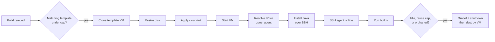

# Proxmox Cloud Plugin

A Jenkins cloud provider that runs your build agents as ephemeral QEMU virtual machines on
[Proxmox VE](https://www.proxmox.com/). When the build queue needs capacity, the plugin clones a VM
template, configures it through cloud-init, connects over SSH, and tears the VM down once it goes
idle. Nothing is left running between builds.

It is built for on-prem and homelab CI: the elastic agent pool is your own Proxmox hardware, so
there is no cloud account, no per-hour bill, and build data never leaves your network. The design
follows the Jenkins [EC2 plugin](https://plugins.jenkins.io/ec2/) closely (see
[Comparison with the EC2 plugin](#comparison-with-the-ec2-plugin)), and the two run well side by
side for a hybrid on-prem/cloud fleet.

## Features

- **On-demand agents** cloned from a VM template, scaled to the build queue and destroyed when idle.
- **Concurrent provisioning** up to the configured cap, so a cloud fills in roughly one clone time
  rather than serially.
- **Per-template and per-cloud instance caps** to bound how many VMs run at once.
- **Warm pool** (per-template minimum instances) that keeps a baseline of agents ready and is never
  idle-reaped below the minimum.
- **Reuse limit** (max total uses) that recycles an agent after a set number of builds.
- **Java auto-install** over SSH (OpenJDK or Amazon Corretto), so templates do not need Java baked in.
- **Disk resize at clone time**, so a thin template image can grow to the agent size on provision.
- **CPU / memory / storage / pool / cloud-init overrides** applied per template.
- **Orphan and dead-node reconciliation** that destroys leaked VMs and removes stale nodes after a
  configurable, per-cloud period.
- **VM-ID-reuse-safe teardown**: every destroy is ownership-verified and idempotent.
- **Configuration as Code** from a YAML file in a git repository, with scheduled sync, drift
  detection, and read-only protection.

## How it works



Disk resize and Java install are skipped when not configured. For contributors, the moving parts are
`ProxmoxCloud` (config + provisioning), `ProxmoxTemplate` (per-VM clone config), `ProxmoxLauncher`
(IP discovery, Java install, SSH handoff), `ProxmoxRetentionStrategy` (idle / reuse decisions), and
`ProxmoxOrphanCleanup` (reconciliation). See [CLAUDE.md](CLAUDE.md) for the full architecture map.

## Setup

### 1. Proxmox API Token

Create a dedicated user, role, and API token on your Proxmox host.

Proxmox v9.x
```bash
# Create a role with minimum required privileges
pveum role add JenkinsProvisioner -privs "VM.Allocate VM.Clone VM.Audit VM.Config.Disk VM.Config.CPU VM.Config.Memory VM.Config.Network VM.Config.Options VM.Config.Cloudinit VM.PowerMgmt VM.GuestAgent.Audit Datastore.AllocateSpace Datastore.Audit SDN.Use"

# Create a user
pveum user add jenkins@pve

# Assign the role at the root path (or scope to a specific /pool/... path)
pveum aclmod / -user jenkins@pve -role JenkinsProvisioner

# Create an API token (--privsep 0 = token inherits user permissions)
pveum user token add jenkins@pve jenkins-token --privsep 0
```

Proxmox v8.x
```bash
# Create a role with minimum required privileges
pveum role add JenkinsProvisioner -privs "VM.Allocate VM.Clone VM.Audit VM.Config.Disk VM.Config.CPU VM.Config.Memory VM.Config.Network VM.Config.Options VM.Config.Cloudinit VM.PowerMgmt VM.Monitor Datastore.AllocateSpace Datastore.Audit SDN.Use"

# Create a user
pveum user add jenkins@pve

# Assign the role at the root path (or scope to a specific /pool/... path)
pveum aclmod / -user jenkins@pve -role JenkinsProvisioner

# Create an API token (--privsep 0 = token inherits user permissions)
pveum user token add jenkins@pve jenkins-token --privsep 0
```

Save the output. You will need:
- **Token ID**: `jenkins@pve!jenkins-token`
- **Token Secret**: the UUID printed by the command

#### Privilege Reference

Proxmox v9.x

| Privilege | Purpose |
|---|---|
| `VM.Allocate` | Create and remove VMs (includes reserving VM IDs and destroying VMs) |
| `VM.Clone` | Clone templates |
| `VM.Audit` | Read VM config and status |
| `VM.Config.Disk` | Configure/resize disks on cloned VMs |
| `VM.Config.CPU` | Override CPU cores |
| `VM.Config.Memory` | Override memory |
| `VM.Config.Network` | Configure network interfaces |
| `VM.Config.Options` | Set general VM options |
| `VM.Config.Cloudinit` | Inject cloud-init parameters |
| `VM.PowerMgmt` | Start, stop, shutdown VMs |
| `VM.GuestAgent.Audit` | Query guest agent for IP address |
| `Datastore.AllocateSpace` | Allocate disk space for clones |
| `Datastore.Audit` | List available storage pools |
| `SDN.Use` | Use network bridges |

Proxmox v8.x

| Privilege                 | Purpose                                                              |
|---------------------------|----------------------------------------------------------------------|
| `VM.Allocate`             | Create and remove VMs (includes reserving VM IDs and destroying VMs) |
| `VM.Clone`                | Clone templates                                                      |
| `VM.Audit`                | Read VM config and status                                            |
| `VM.Config.Disk`          | Configure/resize disks on cloned VMs                                 |
| `VM.Config.CPU`           | Override CPU cores                                                   |
| `VM.Config.Memory`        | Override memory                                                      |
| `VM.Config.Network`       | Configure network interfaces                                         |
| `VM.Config.Options`       | Set general VM options                                               |
| `VM.Config.Cloudinit`     | Inject cloud-init parameters                                         |
| `VM.PowerMgmt`            | Start, stop, shutdown VMs                                            |
| `VM.Monitor`              | Query guest agent for IP address (via the QEMU monitor)             |
| `Datastore.AllocateSpace` | Allocate disk space for clones                                       |
| `Datastore.Audit`         | List available storage pools                                         |
| `SDN.Use`                 | Use network bridges                                                  |

### 2. VM Template with Cloud-Init

Create a VM template that has cloud-init and the QEMU guest agent. The example below uses Ubuntu 24.04, but any cloud-init-enabled image works.

```bash
# Download a cloud image
wget https://cloud-images.ubuntu.com/noble/current/noble-server-cloudimg-amd64.img

# Create a VM (adjust storage and bridge to match your setup)
qm create 9000 --name ubuntu-template --memory 2048 --cores 2 --net0 virtio,bridge=vmbr0

# Import the cloud image as a disk
qm importdisk 9000 noble-server-cloudimg-amd64.img local-lvm

# Attach the disk
qm set 9000 --scsihw virtio-scsi-pci --scsi0 local-lvm:vm-9000-disk-0

# Add a cloud-init drive
qm set 9000 --ide2 local-lvm:cloudinit

# Set boot order to the imported disk
qm set 9000 --boot order=scsi0

# Enable the QEMU guest agent (required for IP discovery)
qm set 9000 --agent enabled=1

# Add serial console (needed for cloud-init on some images)
qm set 9000 --serial0 socket --vga serial0

# Convert to template
qm template 9000
```

**Note:** The default cloud image disk is ~3.5GB. You do not need to resize it here - the plugin can resize the disk at clone time via the "Disk Size GB" template setting. Set it to at least 10GB if you plan to install Java automatically.

The plugin resizes `scsi0` (the disk used in the commands above). If your template's primary disk is on a different bus (`virtio0`, `sata0`), leave Disk Size GB at 0 and size the template image directly.

### 3. SSH Key Pair

Generate a key pair for Jenkins to connect to provisioned VMs:

```bash
ssh-keygen -t ed25519 -f ~/.ssh/jenkins-proxmox -N "" -C "jenkins-agent"
```

Add the **private key** (`~/.ssh/jenkins-proxmox`) as a Jenkins SSH credential (see step 4). The plugin automatically derives the public key from the credential and injects it into VMs via cloud-init at provision time - you do not need to configure the public key separately.

### 4. Jenkins Credentials

You need two credentials in Jenkins. Add both via **Manage Jenkins → Credentials → System → Global credentials → Add Credentials**.

#### Proxmox API Token credential

| Field | Value |
|---|---|
| Kind | **Proxmox API Token** (added by this plugin) |
| Scope | Global |
| ID | e.g. `proxmox-api-token` |
| Description | e.g. `Proxmox API Token` |
| Token ID | `jenkins@pve!jenkins-token` (from step 1) |
| Token Secret | The UUID secret (from step 1) |

#### SSH credential for agent connection

| Field | Value |
|---|---|
| Kind | **SSH Username with private key** |
| Scope | Global |
| Username | `ubuntu` (the default user in Ubuntu cloud images) |
| Private Key | Enter directly → paste contents of `~/.ssh/jenkins-proxmox` (from step 3) |
| ID | e.g. `proxmox-ssh-key` |
| Description | e.g. `Proxmox Agent SSH Key` |

### 5. Jenkins Cloud Configuration

Go to **Manage Jenkins → Clouds → New cloud → Proxmox VE**.

#### Cloud Settings

| Field | Value |
|---|---|
| Cloud Name | e.g. `proxmox` |
| API URL | `https://<proxmox-host>:8006` |
| Credentials | Select the **Proxmox API Token** credential created above |
| Ignore SSL Errors | Check if using self-signed certs (Proxmox default) |

Click **Test Connection** - it should report the Proxmox VE version.

Under cloud **Advanced** you can also set the per-cloud **Instance Cap**, **Operation Timeout**,
**Start VM ID**, and the **Cleanup Orphaned Agents** options. These are covered in
[Agent lifecycle and scaling](#agent-lifecycle-and-scaling).

#### Template Settings

| Field | Value |
|---|---|
| Name | e.g. `ubuntu-agent` |
| Proxmox Node | Your node name (e.g. `pve`, `node1`) |
| Template VM ID | `9000` (or your template ID) |
| Labels | e.g. `linux ubuntu` |
| Number of Executors | `1` |
| Clone Strategy | Full Clone |
| SSH Credentials | Select the **SSH Username with private key** credential |
| Usage | Only build jobs with label expressions matching this node |

Under **Advanced → Proxmox Resources**:

| Field | Value | Description |
|---|---|---|
| Target Storage | *(blank)* | Storage pool for clone disk. Blank = same as template |
| Target Pool | *(blank)* | Proxmox resource pool to place the VM in. Blank = none |
| CPU Cores | `0` | 0 = inherit from template |
| Memory MB | `0` | 0 = inherit from template |
| Disk Size GB | `10` | Resize scsi0 after clone. 0 = keep template size |

Under **Advanced → Agent Settings**:

| Field | Value | Description |
|---|---|---|
| Remote FS Root | `/home/ubuntu/agent` | Must be writable by SSH user. Blank defaults to `/home/<user>/agent` |
| Java Version | OpenJDK 21 | Auto-installs Java if not present |
| Java Path | `java` | Path to the java binary, used only when Java Version is None |
| JVM Options | *(blank)* | Extra options for the agent JVM, e.g. `-Xmx512m` |

Under **Advanced → Cloud-Init**:

| Field | Value |
|---|---|
| User | `ubuntu` (must match the cloud image's default user) |
| IP Configuration | `ip=dhcp` (or `ip=10.0.0.50/24,gw=10.0.0.1` for a static address) |
| Nameserver | *(optional)* DNS server for the agent |
| Search Domain | *(optional)* DNS search domain |

The SSH public key is automatically derived from the SSH credential selected above and injected into the VM via cloud-init.

These fields map to Proxmox's built-in cloud-init parameters (`ciuser`, `sshkeys`, `ipconfig0`, `nameserver`, `searchdomain`), which the plugin sets through the API. Free-form cloud-init user-data is a separate mechanism that is not currently supported (see [Known limitations](#known-limitations)).

#### Lifecycle Settings (Advanced)

| Field | Default | Description |
|---|---|---|
| Idle Termination (minutes) | 30 | Destroy the VM after this idle time. 0 = never |
| Instance Cap | 0 (unlimited) | Max concurrent VMs from this template |
| Instance Minimum | 0 (none) | Warm-pool size kept ready (must be `<= Instance Cap`) |
| Max Total Uses | 0 (unlimited) | Recycle the agent after N builds |
| Startup Wait (seconds) | 60 | Time to wait for VM boot, IP, and SSH |

### 6. Test It

You can manually provision an agent from **Manage Jenkins → Nodes** using the "Provision via" button, or create a freestyle job with a matching label expression:

```bash
hostname
ip addr
java -version
cat /etc/os-release
```

Run it. The plugin will clone the template, resize the disk, boot the VM, install Java, SSH in, execute the build, then terminate after idle timeout.

## Agent lifecycle and scaling

The retention behaviour is intentionally close to the EC2 plugin's. Idle timeout and reuse cap are
seeded from the template at provision time but **owned by each agent**, so you can override them on a
specific agent's config page (for example, to keep one VM alive for diagnostics) without touching the
template.

### Instance caps

Caps apply at two levels. Each **template** has its own `Instance Cap`, and the **cloud** has an
overall `Instance Cap` across all of its templates. Provisioning fills concurrently up to whichever
limit binds first. Dead nodes (a channel offline beyond the grace period, or a phantom whose VM is
gone) are excluded from cap accounting, so a zombie cannot hold a slot and block a healthy
replacement.

### Idle termination

An idle agent is destroyed once it has been idle longer than `Idle Termination (minutes)`. Set it to
0 to disable idle reaping (useful for static, always-on agents, or when a warm pool manages the
count). Agents held by a warm-pool minimum are exempt.

### Reuse limit (max total uses)

`Max Total Uses` caps how many builds an agent runs before it is recycled. The cap is enforced at
dispatch time (so a capped agent stops accepting work immediately) and the agent is destroyed the
moment its last build finishes, rather than waiting for the next periodic check. Use counts are
tracked per task, so they are correct for both freestyle builds and Pipeline `node {}` blocks.

### Warm pool (minimum instances)

Set a template's `Instance Minimum` to keep that many agents provisioned and ready ahead of demand.
The pool is topped up on config save, at startup, on each cleanup tick, and immediately after a
max-uses recycle. The retention strategy will not idle-reap an agent if doing so would drop the
template below its minimum. The minimum must not exceed the instance cap; this is enforced on save.

The warm pool only ever scales **up**. Lowering a minimum drains the surplus through normal idle
termination, so warm agents need `Idle Termination > 0` to ever go away. Because lifecycle settings
are baked in per agent at provision time, set the template's idle timeout before provisioning the
pool.

### Orphan and dead-node cleanup

Enable **Cleanup Orphaned Agents** on the cloud to run a background reconciler. Each pass:

- destroys VMs tagged `jenkins-managed` for this cloud that have no corresponding Jenkins node
  (leaked, for example, by a controller crash mid-provision), and
- removes Jenkins nodes whose backing VM is gone or stopped, or whose agent channel has been offline
  past the grace period while the VM still runs.

The **Orphan Cleanup Period** (default 600s, minimum 30s) controls how often a cloud is reconciled
and is editable live in the UI. A freshly cloned or briefly disconnected agent is protected by the
**Orphan Cleanup Grace Period** (default 300s) so it is never reaped mid-launch. Every destroy first
re-confirms the VM still carries this cloud's ownership marker, so a reused VM ID is never destroyed
by mistake.

> Lowering a cloud's period *below* the cadence the reconciler is already scheduled at requires a
> Jenkins restart to take effect faster; an administrative monitor surfaces this when it happens.
> The `jenkins.proxmox.orphanCleanupPeriodMs` system property overrides both the cadence and the
> per-cloud period for every cloud.

### Start VM ID

`Start VM ID` (cloud Advanced) sets the floor for cloned VM IDs. Set it above every existing VM and
container ID on the node so provisioning never collides with manually managed guests. The plugin
reserves the lowest free ID at or above this floor for each clone.

## Java auto-installation

The plugin can automatically install a JRE on provisioned agents, eliminating the need to bake Java into your template image. Supported options:

| Option | Package |
|---|---|
| OpenJDK 21 | `openjdk-21-jre-headless` |
| OpenJDK 25 | `openjdk-25-jre-headless` |
| Amazon Corretto 21 | `java-21-amazon-corretto-jdk` |
| Amazon Corretto 25 | `java-25-amazon-corretto-jdk` |

The install process:
1. Waits for cloud-init to finish (avoids apt lock conflicts)
2. Cleans apt cache to free disk space
3. Installs the selected JRE (adding the Corretto apt repository first, for the Corretto options)
4. Removes unneeded packages and cleans up

Requirements: the SSH user must have passwordless `sudo` access (default for Ubuntu cloud images).

When Java Version is **None**, no install runs and the agent uses the `Java Path` you configure (or
auto-detects `java` on the PATH if left at the default).

## Manual provisioning

The **Nodes** page (`/computer/`) shows a "Provision via [cloud name]" button for each configured template. Clicking it immediately clones and starts a VM without waiting for demand.

## Configuration as Code

Cloud and template configuration can live in a YAML file in a git repository and be synced into
Jenkins on a schedule or on demand. This keeps your agent fleet in source control: review changes via
pull request, and let Jenkins apply them. Only clouds defined in the YAML are managed; clouds you
create by hand in the UI are left untouched.

### Enabling sync

Go to **Manage Jenkins → System → Proxmox Cloud Config Sync** and enable it.

| Field | Description |
|---|---|
| Git Repository URL | Repo containing the YAML config |
| Git Credentials | Jenkins credentials for git auth (optional for public repos) |
| Branch | Branch to read (default: `main`) |
| YAML File Path | Path within the repo (default: `proxmox-cloud.yaml`) |
| Sync Schedule (cron) | Jenkins cron expression for automatic sync (blank disables it) |
| Allow manual changes | When unchecked, managed clouds render read-only in the UI |

Use **Test Git Connection** to verify connectivity and that the file exists, and **Sync Now** to
apply immediately.

### YAML structure

Configuration is layered. A cloud inherits `cloudDefaults`; an agent template inherits
`agentDefaults`, then per-node `agentDefaults-<node>`, then its own keys (later layers win). Each
agent template links to one or more clouds by their `cloudConfigurations` key via `cloudIds`.

```yaml
# Defaults applied to every cloud below.
cloudDefaults:
  apiUrl: "https://proxmox.example.com:8006"
  credentialsId: "proxmox-api-token"   # Proxmox API Token credential ID
  ignoreSslErrors: true
  instanceCap: 20                       # cloud-wide cap across all templates
  operationTimeoutSec: 300
  startVmId: 500                        # clone IDs start here
  cleanupOrphanedAgents: true
  orphanCleanupPeriodSeconds: 600
  orphanCleanupGracePeriodSeconds: 300

# One entry per cloud. Inherits cloudDefaults; override per cloud as needed.
cloudConfigurations:
  primary:
    name: "Proxmox Production"          # the cloud's display name (required)
  secondary:
    name: "Proxmox Lab"
    apiUrl: "https://proxmox-lab.example.com:8006"
    instanceCap: 5

# Defaults applied to every agent template.
agentDefaults:
  cloneStrategy: FULL                   # FULL or LINKED
  credentialsId: "proxmox-ssh-key"      # SSH credential ID
  mode: EXCLUSIVE                       # NORMAL or EXCLUSIVE
  remoteFs: "/home/ubuntu/agent"
  ciUser: "ubuntu"
  ipConfig: "ip=dhcp"
  javaVersion: OPENJDK_21               # NONE, OPENJDK_21/25, CORRETTO_21/25
  jvmOptions: "-Xmx512m"
  idleTerminationMinutes: 30
  startupWaitSeconds: 120

# Per-node defaults, selected by an agent's `node` value.
agentDefaults-pve1:
  templateVmId: 9000
  targetStorage: "local-lvm"

agentDefaults-pve2:
  templateVmId: 9100
  targetStorage: "ceph-pool"

# Agent templates. Each links to clouds via cloudIds.
agentConfigurations:
  linux-builder:
    cloudIds: ["primary", "secondary"] # this template is added to both clouds
    node: "pve1"                        # selects agentDefaults-pve1
    name: "linux-builder"
    labelString: "linux docker"
    numExecutors: 2
    cores: 8                            # override the template image's CPU
    memoryMb: 16384
    diskSizeGb: 40
    instanceCap: 6
    instanceMin: 2                      # keep 2 warm
    maxTotalUses: 50                    # recycle after 50 builds

  arm64-runner:
    cloudIds: ["secondary"]
    node: "pve2"
    name: "arm64-runner"
    labelString: "linux arm64"
    numExecutors: 1
    templateVmId: 9101                  # override the per-node default
```

Recognised cloud keys: `name`, `apiUrl`, `credentialsId`, `ignoreSslErrors`, `instanceCap`,
`operationTimeoutSec`, `startVmId`, `cleanupOrphanedAgents`, `orphanCleanupPeriodSeconds`,
`orphanCleanupGracePeriodSeconds`.

Recognised agent keys: `node`, `name`, `templateVmId`, `labelString`, `numExecutors`,
`cloneStrategy`, `targetStorage`, `targetPool`, `cores`, `memoryMb`, `diskSizeGb`, `remoteFs`,
`mode`, `credentialsId`, `javaVersion`, `javaPath`, `jvmOptions`, `idleTerminationMinutes`,
`instanceCap`, `instanceMin`, `maxTotalUses`, `namePrefix`, `startupWaitSeconds`, `ciUser`,
`ipConfig`, `nameserver`, `searchDomain`.

### Behavior

- **All-or-nothing**: if any cloud or template in the YAML is invalid, no changes are applied.
- **Config-managed clouds** show a green "Config Managed" badge with the last sync time.
- **Manual edits** to a managed cloud are flagged with an amber warning that clears on the next sync.
- **Read-only protection**: with "Allow manual changes" unchecked, managed cloud forms are read-only.

## Comparison with the EC2 plugin

This plugin is modelled on the Jenkins [EC2 plugin](https://plugins.jenkins.io/ec2/). Several
internals are deliberate analogues, so if you have run the EC2 plugin the configuration and behaviour
will feel familiar.

**Shared model**

- A *cloud* holds connection config and one or more *templates* (the EC2 plugin's AMIs / slave
  templates).
- Agents are provisioned on demand when the queue has work matching a template's labels, connected
  over SSH, and terminated when idle.
- Per-template instance cap, idle retention, max-total-uses reuse cap, a minimum-instances warm pool,
  and background reconciliation of leaked instances and dead nodes all have direct counterparts.

**Where this plugin differs**

- It runs on **your own Proxmox hardware**: no cloud account, no per-hour billing, and build data
  stays on your network.
- It provisions by **cloning a VM template and configuring it through cloud-init**, rather than
  launching an AMI.
- It **installs the agent JRE over SSH** at launch, so you do not have to bake Java into every image.
- It **resizes the clone's disk** through the API, so one thin template image serves agents of
  different sizes.
- It ships a **built-in git-backed YAML config sync** with drift detection and read-only protection,
  rather than relying solely on JCasC or Groovy.
- Teardown is **ownership-verified and idempotent** to stay safe against Proxmox VM-ID reuse.
- Idle timeout and reuse cap are **editable per agent** after provisioning, not just on the template.

**On-prem, homelab, and hybrid**

The EC2 plugin pitches itself as a way to spill spiky load from a small in-house cluster out to EC2.
This plugin is the other half of that story: it turns your own Proxmox capacity into the elastic
agent pool, which is a strong fit for homelabs and on-prem CI where a cloud bill or data egress is
unwelcome. It also runs happily **alongside** the EC2 plugin. Jenkins supports multiple clouds at
once, so you can keep steady or sensitive workloads on local Proxmox capacity and burst to EC2 for
spikes, routing jobs to either by label.

## Known limitations

- **QEMU only.** LXC containers are not supported.
- **SSH only.** Agents connect over SSH; there is no inbound JNLP/WebSocket launcher. This is a
  design choice, not a limitation of the Proxmox API: the controller dials out to each agent over
  SSH once cloud-init has injected the key, which keeps provisioning simple and matches the EC2
  plugin's default for Unix hosts. It is unrelated to the user-data limitation below.
- **User Data Script is not applied**
  ([#23](https://github.com/aidanc/proxmox-cloud-plugin/issues/23)). Custom cloud-init user-data
  needs a snippet referenced through `cicustom`, and the Proxmox API cannot store snippets: its
  storage upload endpoint only accepts `content=iso|vztmpl|import`. The snippet would have to be
  placed on the Proxmox host filesystem out of band (for example copied over SSH to the host under
  `/var/lib/vz/snippets/`), which the plugin does not do, so the field is ignored. The native
  cloud-init parameters (user, SSH key, IP, DNS) are unaffected and work normally. Free-form
  user-data could be supported on request, but would require pre-staging the snippet on the Proxmox
  host yourself.

## Building from Source

```bash
mvn clean verify    # Run tests and build the HPI
mvn hpi:run         # Start Jenkins locally with the plugin at http://localhost:8080/jenkins/
```

The built plugin is at `target/proxmox-cloud.hpi`.

## Contributing

Found a bug or have a feature request? Please open an issue on the [GitHub issue tracker](https://github.com/jenkinsci/proxmox-cloud-plugin/issues).

Pull requests are welcome. To build and test locally:

```bash
mvn clean verify
```

## License

MIT License
